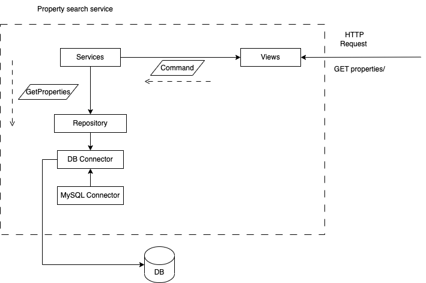

# HABI TEST

Microservice to search available real estate and rating them based on its
characteristics

## Related Technologies

[](https://www.python.org/downloads/)

## General Questions
- how to check PEP8 or any linter over python? use pre-commit? or fixed linter execution?
  - R/ fixed linter execution will be enough, `black, flake8 and isort` will be configured
- How to simulate the incoming requests?
  - R/ creates a requests.json file to simulate the fronts requests
- It would be necessary a docker compose setup or a Dockerfile would be enough?
  - R/ there is only one docker image, docker compose is unnecessary

## Search Service

Microservice to filtered search about available properties, service can list
both sold or for sale properties based on determinate filters

### Filters
- status:
  - name *(available status names: pre_venta, en_venta, vendido)*

- property:
  - id
  - address
  - city
  - price
  - year

the structure required on build filter would be `type_filter.field` so in this case a filter
would look like `status.name` or `property.city`. service expects that the entrypoint be able
to create the filter in that way.

### Service Response

Service would respond with a list of properties filtered or not that would have the following
response body:

````json
[
  {
    "id": "1",
    "address": "address",
    "city": "city",
    "price": "price",
    "description": "description",
    "status": {
      "name": "en_venta",
      "label": "Inmueble publicado en venta"
    }
  },
  {
    "id": "1",
    "address": "address",
    "city": "city",
    "price": "price",
    "description": "description",
    "status": {
      "name": "en_venta",
      "label": "Inmueble publicado en venta"
    }
  }
]
````

Responses are `python-dict` formatted so, json or any other response type are not available


### Architecture Planned

Service was built over a set of concepts related to a these principal architectures:
  - MVC
  - Event-Driven
  - Domain-Drive

although, none of architectures are fully implemented, there are some concepts implemented
on the 3 main modules:

- views:
  - Event Driven command segregation was implemented, related a specific command to a specific actions
  in this case a simulated bus was implemented and `get-view` registry the command to the specific action
  in order to handle the incoming requests.
  - MVC, once a command is able to process the request, this will be sent to the controller module to
  load the related model and perform the requested query

- services:
  - Event Driven, commands and handlers are registered here, view is in charge to relate the command
  to its handler, this was implemented like this to avoid the creation or configuration of any service
  like message buses to handle the command

- repositories:
  - Domain Driven, in this module the repository pattern rely on some methods to transform SQL query's onto
  domain models, this domain models works to be process on domain logics (services)





### Questions
- Use a simple MVC pattern or try to implement a little version of event-driven/domain-driven?
  - R/ MVC pattern is lightweight and easy architectural way to implement projects, even though
  make little implementations of domain-driven to create models outside any database abstractions
  and implemente `to_domain` methods on repositories to transform the object.
  On view, try to make an implementation of a classed based views and create a mechanism to simulate
  commands query's without the need of a message bus
  

- how to handle http request without a framework?, do I use a microframework or maybe implement
  a http service based on some python core library? (eg. http, requests, etc.) and which design pattern to 
  implement view over http implementation? (decorator to handled filters?)
  - R/ there's no need to create a http requests handlers, every request would be simulated through a `requests.json` 
    file, but the usage of decorator pattern is exaggerated, handle the filters as a `python-dicts`


- Propose a generic database access system, how much time it will be required to fully propose
  all the abstraction layer?
  -  R/ an entire abstraction to database access is too much, create a simple class to build the queries,
    and make it as abstracts as it can be:
    - To models were created:
      - Query() -> handle the querys creation, receives tables names, columns, order_by and where statements
      although, a base_query attribute was created to pass a full SQL query
      - Join() -> handle joins statements, receives tables and join_column but it does not support different types
      of joins like `lEFT or RIGTH` joins


- how to construct a db connector?, define a strategy to make queries through only python
  -  R/ `mysql_python_connector` library resolves this problem, an interface was created to handle the basic
    operations (select and insert) if any other database wants to be supported, create the specific implementation


- how to handle with filters? create an abstraction layer or simple do passthrough 
  to the database access layer?
  -  R/ an abstraction was des-prioritized due lack of time, filters will be a simple `python-dicts`
    these filters can be use on repositories and the database connector will be handled them
    see [Filters Section](#filters)


- It will be necessary to create a presenting class that would be able to handle the
  fake requests and provide a response or simple expose the repository module?
  - R/ a simil to a *Django Class Based View* would be enough to handle the fake request,
  this would be the MVC meaningfully

### Testing Questions
- How to test the repositories, creates a test database or handled the suit test with the
  existing database?
  - R/ there isn't enough time to create fake repositories, we would rely on database
  consistency to perform the tests
- Provide a test coverage report?
  - R/ pytest-cov library able a simple CLI interface to make reports, tests coverage and 
  missing statements would be configured
  
## Run Service
To run the tests suites that involves all the proposed cases do the following:
```bash
make config  # this will setup all the suite
make up # this will execute the tests suite
```

or if you prefer do this following this docker commands:
```bash
# build images
docker build . -t search_service

# run the formatters and linters
docker run -it -t search_service black . --line-length 82 && flake8 . && isort .

# run container
docker run -it -t search_service
```