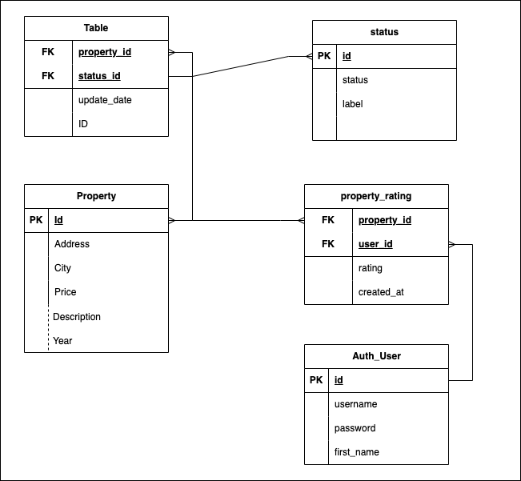

# Property Rating System

This project implements a functionality to rate properties through an HTTP request, using Python and MySQL.
takes as example the search_property app and add some modifications to systems works

## Project Structure
The project is structured as follows:

- rating_services/: the core logic for handling property rating requests
  - `services/`
  - `repositories/`
  - `views/`
  - `tests/`
  - `database/`: the module containing the database connection settings and tables required

## Architecture
Having in count the previous app `search_property`, we propose a cloud
architecture that supplies all the additional infrastructure required like:
- Load Balancing
  - handling the several possible request to the system
- DB *(RDS)*
  - Keeps the MySQL database
- Redis
  - Cache system to store the average rating of every property
- logging *(CloudWatch)*
  - Log tracing for every app

## Database Structure
The database is structured as follows (see [setup](database/setup.sql)):

- property table: stores property information, including id, address, city, price, and year.
- property_rating table: stores property ratings given by users.

property has a one-to-many relationship to table property_rating and for handling to obtain
average rating from a determinate property, there will be a view storing these results, grouping the
row by `property_id` and perform an `AVG` aggregation function to get this value
***see([views](database/views.sql))***

## API Endpoints
The app would expose the following API endpoints:

- POST /properties/:id/rating: rate a property with the given id.
- GET /properties/:id/average_rating: get the average rating of the property with the given id.

## Future Work
Some possible improvements to the project could include:

- Implementing throttle on rating endpoint to prevent an abuse
- Adding more detailed error handling and response codes to the API.